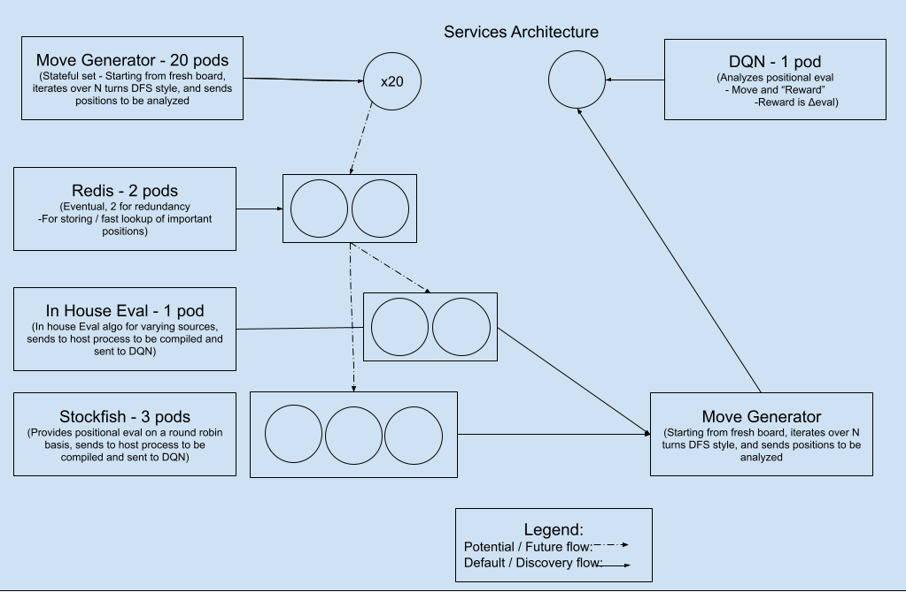

# Brute-Force Chess
  
## This is a machine learning project, to try and train a DQN by brute forcing chess positions.  
  
# Docker Images
New Docker images are cut with every commit to main, and can be found in [DQN](https://hub.docker.com/repository/docker/jackhlay/chessdqn) & [Crawler](https://hub.docker.com/repository/docker/jackhlay/chesscrawler)  

# Cluster Architechture
See the diagram below.  
  
  
  
- This system architecture involves deploying 20 pods in a stateful set for the Move Generator (Crawler), which iterates over a fresh board to generate possible moves (using DFS).  
- These generated positions are passed into an in-house evaluation algorithm and Stockfish for positional evaluations.  
- In the future, the system may store important positions in Redis (for fast retrieval), and after evaluation, tensors are created that represent the board states before and after the move, their respective evaluations, and the chosen move.  
- This data is then sent to the DQN (Deep Q-Network) pod for analysis and training.  
  

# Project Goal    
- The end goal of this project is to be able to use the dqn as part of a chess engine, and allow it to seek challenges and play games through the LiChessbots api, and watch it grow in skill.

Uses [ivangabriele/dockfish](https://github.com/ivangabriele/dockfish) for stockfish interaction  
